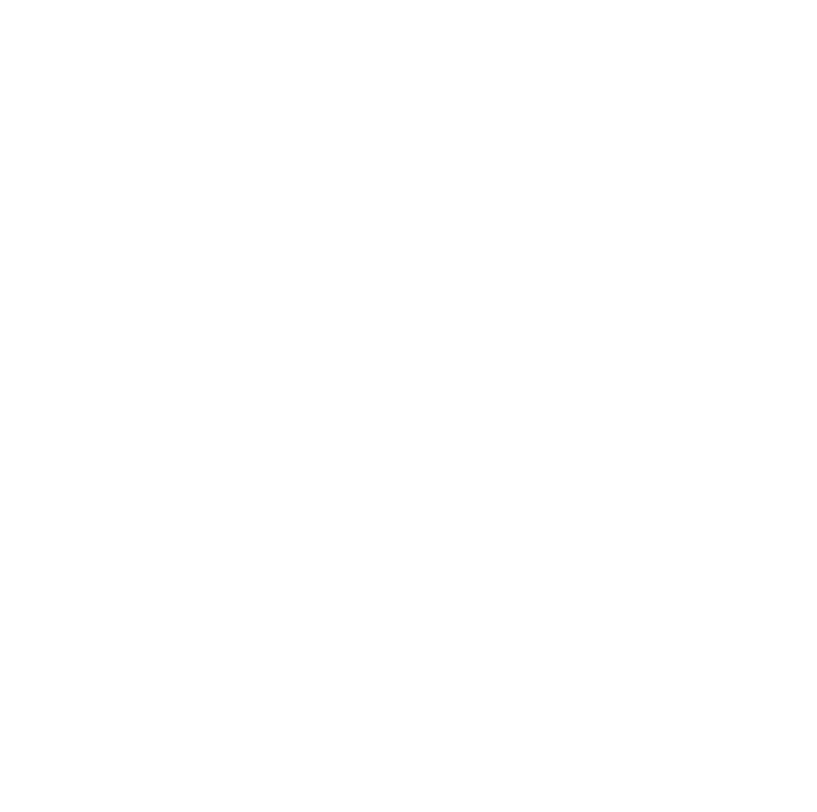

# Convex + BetterAuth




A modern authentication application built with Next.js, featuring Convex as the backend-as-a-service and BetterAuth for authentication management. This project demonstrates a complete authentication flow with user registration, login, and session management.

## Features

- Complete authentication system with BetterAuth
- Real-time data synchronization with Convex
- Modern UI with Tailwind CSS and Radix UI components
- Dark mode support
- Built with Next.js 15 and React 19
- TypeScript for type safety
- Social authentication support
- Real-time user session management

## Tech Stack

- **Framework**: Next.js 15 with App Router
- **Frontend**: React 19, TypeScript
- **Styling**: Tailwind CSS, Radix UI
- **Backend**: Convex (Backend-as-a-Service)
- **Authentication**: BetterAuth
- **Package Manager**: npm/yarn/pnpm/bun

## Prerequisites

Before you begin, ensure you have the following installed:
- Node.js 18+ 
- npm, yarn, pnpm, or bun
- A Convex account ([convex.dev](https://convex.dev))

## Setup Instructions

### 1. Clone the Repository

```bash
git clone https://github.com/gayakaci20/convex-betterauth
cd convex-betterauth
```

### 2. Install Dependencies

Choose your preferred package manager:

```bash
# npm
npm install

# yarn
yarn install

# pnpm
pnpm install

# bun
bun install
```

### 3. Environment Configuration

Copy the example environment file and configure it:

```bash
cp env.example .env.local
```

Open `.env.local` and configure the following variables:

```env
# Convex Configuration
CONVEX_DEPLOYMENT=dev:your-deployment-name
NEXT_PUBLIC_CONVEX_URL=https://your-deployment.convex.cloud
NEXT_PUBLIC_CONVEX_SITE_URL=https://your-deployment.convex.site

# BetterAuth Configuration
BETTER_AUTH_SECRET=your-super-secret-key-here

# Local Development
SITE_URL=http://localhost:3000
```

#### Environment Variables Explained:

- **CONVEX_DEPLOYMENT**: Your Convex deployment identifier (get this from Convex dashboard)
- **NEXT_PUBLIC_CONVEX_URL**: Your Convex deployment URL (public, used by client)
- **NEXT_PUBLIC_CONVEX_SITE_URL**: Your Convex site URL for authentication
- **BETTER_AUTH_SECRET**: A secure secret key for BetterAuth (generate a strong random string)
- **SITE_URL**: Your application URL (localhost for development)

### 4. Set Up Convex

1. **Create a Convex account** at [convex.dev](https://convex.dev)

2. **Install Convex CLI** (if not already installed):
   ```bash
   npm install -g convex
   ```

3. **Initialize Convex in your project**:
   ```bash
   npx convex dev
   ```
   
   This will:
   - Create a new Convex deployment
   - Generate the necessary configuration
   - Provide you with the deployment URL and site URL

4. **Update your `.env.local`** with the values provided by Convex CLI

### 5. Generate BetterAuth Secret

Generate a secure secret for BetterAuth:

```bash
# Using openssl
openssl rand -base64 32

# Using Node.js
node -e "console.log(require('crypto').randomBytes(32).toString('base64'))"
```

Add this secret to your `.env.local` file as `BETTER_AUTH_SECRET`.

### 6. Run the Development Server

Start the development server:

```bash
# npm
npm run dev

# yarn
yarn dev

# pnpm
pnpm dev

# bun
bun dev
```

The application will be available at [http://localhost:3000](http://localhost:3000).

## Project Structure

```
convex-betterauth/
├── convex/                # Convex backend configuration
│   ├── auth.config.ts     # Authentication configuration
│   ├── auth.ts            # Auth functions
│   └── convex.config.ts   # Convex configuration
├── src/
│   ├── app/               # Next.js App Router
│   │   ├── api/auth/      # Authentication API routes
│   │   ├── login/         # Login page
│   │   ├── register/      # Registration page
│   │   └── page.tsx       # Home page
│   ├── components/        # React components
│   │   ├── ui/            # UI components
│   │   └── ...            # Feature components
│   └── lib/               # Utility libraries
├── public/                # Static assets
├── env.example            # Environment variables template
└── package.json           # Dependencies and scripts
```

## Available Scripts

- `npm run dev` - Start development server with Turbopack
- `npm run build` - Build for production with Turbopack
- `npm run start` - Start production server
- `npm run lint` - Run ESLint

## Authentication Flow

The application includes:

1. **User Registration** (`/register`) - Create new user accounts
2. **User Login** (`/login`) - Sign in existing users
3. **Protected Routes** - Automatic redirection for unauthenticated users
4. **Session Management** - Real-time session validation
5. **Social Login** - Support for social authentication providers

## Deployment

### Vercel (Recommended)

1. Push your code to a Git repository
2. Connect your repository to Vercel
3. Configure environment variables in Vercel dashboard
4. Deploy

### Other Platforms

Ensure you set the environment variables on your deployment platform and update the `SITE_URL` to match your production domain.

## Troubleshooting

### Common Issues

1. **Convex connection errors**: Verify your `CONVEX_DEPLOYMENT` and `NEXT_PUBLIC_CONVEX_URL` are correct
2. **Authentication not working**: Check that `BETTER_AUTH_SECRET` is set and `SITE_URL` matches your current domain
3. **Build errors**: Ensure all environment variables are properly set

### Getting Help

- [Convex Documentation](https://docs.convex.dev)
- [BetterAuth Documentation](https://better-auth.com)
- [Next.js Documentation](https://nextjs.org/docs)

## License

This project is OpenSource